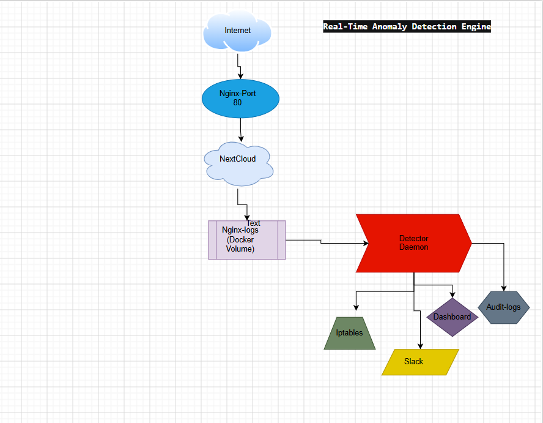

# HNG Stage 3 — Real-Time Anomaly Detection Engine

This is a self-learning intrusion detection system that monitors Nginx access logs in real time, builds a statistical baseline of normal traffic and automatically blocks anomalous IPs using iptables with Slack alerts, progressive auto-unban and a live metrics dashboard.


## 🔗 Live Links


 **Server IP** : `http://52.55.205.119` 
 **Metrics Dashboard** : `http://52.55.205.119:8888` 
 **GitHub Repo** : `https://github.com/Cybertemi/hng-stage3` |
 **Blog Post** : `YOUR_MEDIUM_OR_HASHNODE_BLOG_LINK` |

> Both the server and dashboard are live during the grading window.

## Project Overview

## 🧩 Project Overview

This system was built to protect **HNG cloud.ng (Nextcloud platform)** after suspicious traffic activity.

It continuously:

- Monitors all incoming HTTP requests (via Nginx logs)
- Learns normal traffic behavior from real data
- Detects anomalies using statistical methods
- Responds automatically (block or alert)

It runs as a **long-lived daemon**, not a script or cron job.

HNG's cloud.ng is a rapidly growing cloud storage platform powered by Nextcloud. After a wave of suspicious activity,as a DevSecOps Engineer, I was tasked with to building an anomaly detection engine that:

- Watches all incoming HTTP traffic in real time (via Nginx logs)
- Learns what normal traffic looks like from actual data
- Detects anomalies using statistical methods
- Automatically responds when something deviates from a single aggressive
  IP or a global traffic spike

This system runs as a daemon that continuously runs background process
that never stops. Also, it is not a cron job or a one-shot script.


## Architecture



```
Internet Traffic
      │
      ▼
┌─────────────────────────────┐
│         Nginx               │  ← Reverse proxy
│   Port 80 (public)          │  ← Logs every request as JSON
│   JSON access logs          │  ← Nextcloud never directly exposed
└──────────┬──────────────────┘
           │ proxy_pass
           ▼
┌─────────────────────────────┐
│        Nextcloud            │  ← The actual app (pre-built)
│   Internal network only     │  ← Not accessible from outside
└─────────────────────────────┘

┌─────────────────────────────────────────────────────┐
│              Detector Daemon (Python)                │
│                                                      │
│  monitor.py   → reads Nginx JSON log line by line   │
│  baseline.py  → computes rolling mean + stddev       │
│  detector.py  → z-score + rate multiplier checks    │
│  blocker.py   → iptables DROP rules                 │
│  unbanner.py  → progressive backoff auto-unban      │
│  notifier.py  → Slack webhook alerts                │
│  dashboard.py → live metrics web UI                 │
│  audit.py     → structured audit log                │
└──────────────────────┬──────────────────────────────┘
                       │ reads (read-only)
                       ▼
┌─────────────────────────────┐
│     HNG-nginx-logs volume   │  ← Shared Docker volume
│  /var/log/nginx/            │  ← Nginx writes, detector reads
│  hng-access.log             │
└─────────────────────────────┘
```

---

## Language Choice

**Python** was chosen for the following reasons:

- Built-in `collections.deque` is perfect for implementing sliding windows
  without any external libraries
- `threading` module handles concurrent log monitoring, baseline
  recalculation, and dashboard serving cleanly
- `subprocess` gives direct access to `iptables` for IP blocking
- Flask provides a lightweight dashboard server with minimal overhead
- Readable syntax makes the detection logic easy to audit and verify

---

## How the Sliding Window Works

The sliding window tracks request rates over the last 60 seconds using
Python's `collections.deque`.

**The structure:**
- Each IP has its own deque of timestamps
- There is one global deque for all traffic combined
- Every time a request arrives, its timestamp is appended to the right

**The eviction logic:**
- Before counting, expired timestamps are removed from the left
- A timestamp is expired if it is older than 60 seconds from now
- The length of the deque after eviction = requests in the last 60 seconds

```python
# Adding a new request
self.ip_windows[ip].append(time.time())

# Evicting expired entries
cutoff = time.time() - 60
while window and window[0] < cutoff:
    window.popleft()

# Current rate = what remains
rate = len(window)
```

## NOTE
The sliding window is implemented from scratch using only Python's standard library and rate-limiting libraries are used.

---

## How the Baseline Works

The baseline answers the question: **what does normal traffic look like?**

**Window size:** 30 minutes of per-second request counts

**Recalculation interval:** Every 60 seconds, the detector does the following:

1. Takes all (timestamp, count) pairs from the last 30 minutes
2. Computes the arithmetic mean of request counts per second
3. Computes the standard deviation
4. Saves the result to a per-hour slot

**Per-hour slots:** The detector keeps separate baseline values for each
hour of the day. It prefers the current hour's baseline when enough data
exists which means a busy lunch hour does not cause false alarms
compared to a quiet overnight baseline.

**Floor values:** Standard deviation is floored at 1.0 to prevent
division-by-zero in z-score calculations. The baseline only activates
after a minimum of 5 samples — preventing false alarms on startup.

**The baseline is never hardcoded:** which always reflects actual recent
traffic patterns.

---

## How Anomaly Detection Works

Two checks run on every request:

### Check 1 — Z-Score
```
z = (current_rate - baseline_mean) / baseline_stddev
```
If `z > 3.0`, the rate is more than 3 standard deviations above normal.
This is statistically anomalous, this would only happen by chance 0.3%
of the time under normal conditions.

### Check 2 — Rate Multiplier
```
if current_rate > baseline_mean × 5.0
```
If the rate is more than 5 times the baseline mean, regardless of
standard deviation; it is flagged. This catches attacks during periods
of very stable and predictable traffic where the stddev is small.

**Whichever check fires first triggers the response.**

### Error Surge Detection

If an IP's 4xx/5xx error rate exceeds 3× the baseline error rate, its
detection thresholds are automatically tightened by 30% and it gets
flagged faster because error spikes indicate probing behaviour.

---

## What Happens When an Anomaly is Detected

### Per-IP Anomaly

1. An `iptables DROP` rule is added for that IP within 10 seconds
2. All packets from that IP are silently dropped at OS level
3. A Slack alert is sent with: IP, condition, rate, baseline, z-score
4. An audit log entry is written

### Global Anomaly
1. A Slack alert is sent (no IP block — it affects all traffic)
2. An audit log entry is written

---

## Auto-Unban Schedule

Bans are not permanent by default. The detector uses a progressive
backoff schedule:

| Offence | Ban Duration |
|---|---|
| 1st ban | 10 minutes |
| 2nd ban | 30 minutes |
| 3rd ban | 2 hours |
| 4th ban onwards | Permanent |

Every unban sends a Slack notification and the unbanner checks every
30 seconds for expired bans.

---

## Repository Structure

```
hng-stage3/
├── docker-compose.yml          # Full stack orchestration
├── nginx/
│   └── nginx.conf              # JSON logging + reverse proxy config
├── detector/
│   ├── Dockerfile              # Python container with iptables
│   ├── requirements.txt        # pyyaml, requests, flask, psutil
│   ├── config.yaml             # All thresholds — nothing hardcoded
│   ├── main.py                 # Entry point — wires everything together
│   ├── monitor.py              # Tails and parses Nginx JSON log
│   ├── baseline.py             # Rolling 30-min mean/stddev tracker
│   ├── detector.py             # Sliding window anomaly detection
│   ├── blocker.py              # iptables ban/unban + backoff schedule
│   ├── notifier.py             # Slack webhook alerts
│   ├── audit.py                # Structured audit log writer
│   └── dashboard.py            # Flask live metrics dashboard
├── docs/
│   └── architecture.png        # System architecture diagram
├── screenshots/
│   ├── tool-running.png
│   ├── ban-slack.png
│   ├── unban-slack.png
│   ├── global-alert-slack.png
│   ├── iptables-banned.png
│   ├── audit-log.png
│   └── baseline-graph.png
└── README.md
```

---

## Prerequisites

| Requirement | Minimum |
|---|---|
| Linux VPS | 2 vCPU, 2 GB RAM |
| OS | Ubuntu 22.04 or 24.04 |
| Docker | 24.x |
| Docker Compose | 2.x (plugin) |
| Open ports | 80 (HTTP), 8888 (Dashboard) |
| Slack workspace | For webhook alerts |

---

## Setup Instructions — Fresh VPS to Fully Running Stack

### Step 1 — Install Docker

```bash
sudo apt update && sudo apt upgrade -y
sudo apt install -y docker.io docker-compose-plugin git curl
sudo usermod -aG docker ubuntu
newgrp docker
```

### Step 2 — Clone the repository

```bash
git clone https://github.com/YOUR_USERNAME/hng-stage3.git
cd hng-stage3
```

### Step 3 — Add your Slack webhook URL

```bash
nano detector/config.yaml
# Replace the webhook_url value with your Slack webhook URL
```

### Step 4 — Start the full stack

```bash
docker compose up -d --build
```

### Step 5 — Verify everything is running

```bash
# Check all containers
docker compose ps

# Check Nextcloud is accessible
curl -I http://localhost

# Check dashboard is live
curl http://localhost:8888/api/metrics

# Watch detector logs
docker-compose logs -f detector
```

### Step 6 — Verify JSON logs are being written

```bash
docker exec nginx tail -5 /var/log/nginx/hng-access.log
```

You should see JSON lines like:
```json
{"source_ip":"1.2.3.4","timestamp":"2026-04-27T09:00:00+00:00","method":"GET","path":"/","status":200,"response_size":4190,"request_time":0.002}
```

---

## What a Successful Startup Looks Like

```
NAME        STATUS          PORTS
nextcloud   Up              80/tcp
nginx       Up              0.0.0.0:80->80/tcp
detector    Up              (network_mode: host)
```

Detector logs:
```
[main] HNG Anomaly Detector starting...
[main] Dashboard → http://0.0.0.0:8888
[monitor] Waiting for log: /var/log/nginx/hng-access.log
[monitor] Log found — tailing...
* Running on http://0.0.0.0:8888
```

Dashboard at `http://YOUR_SERVER_IP:8888` shows live metrics refreshing
every 3 seconds.

---

## Configuration Reference

All thresholds live in `detector/config.yaml`. Nothing is hardcoded.

```yaml
sliding_window_seconds: 60        # track requests in last 60s
baseline_window_minutes: 30       # rolling baseline window
baseline_recalc_interval: 60      # recalculate every 60 seconds
baseline_min_samples: 5           # minimum samples before activating
zscore_threshold: 3.0             # flag if z-score exceeds this
rate_multiplier_threshold: 5.0    # flag if rate > 5x baseline mean
error_rate_multiplier: 3.0        # tighten thresholds on error surge
unban_schedule:
  - 600                           # 1st ban: 10 minutes
  - 1800                          # 2nd ban: 30 minutes
  - 7200                          # 3rd ban: 2 hours
slack:
  webhook_url: "your-webhook-url"
```

---

## Audit Log Format

Every ban, unban, and global anomaly is written to
`/var/log/detector/audit.log`:

```
[2026-04-27 09:35:00 UTC] BAN 89.169.47.115 | rate_multiplier | 312 | 2.40 | 600
[2026-04-27 09:45:00 UTC] UNBAN 89.169.47.115 | - | - | - | -
[2026-04-27 09:36:00 UTC] GLOBAL_ANOMALY - | - | 487 | 12.30 | -
```

Format: `[timestamp] ACTION ip | condition | rate | baseline | duration`

---

## Security Practices

- Nextcloud is **never directly exposed** hence, all traffic goes through Nginx
- No secrets are hardcoded & webhook URL lives in config only
- The detector runs with `NET_ADMIN` capability only — minimum privilege
  needed for iptables
- No third-party security tools (Fail2Ban etc) are used, instead iptables is used
- Sliding window built from scratch using Python deque
- Baseline is always computed from real traffic — never hardcoded

✍️ Blog Post

The full breakdown is available on medium:

👉 YOUR_BLOG_LINK : https://medium.com/@iloritemitope1999/how-i-built-a-real-time-intrusion-detection-system-from-scratch-c3d17c013fbc
